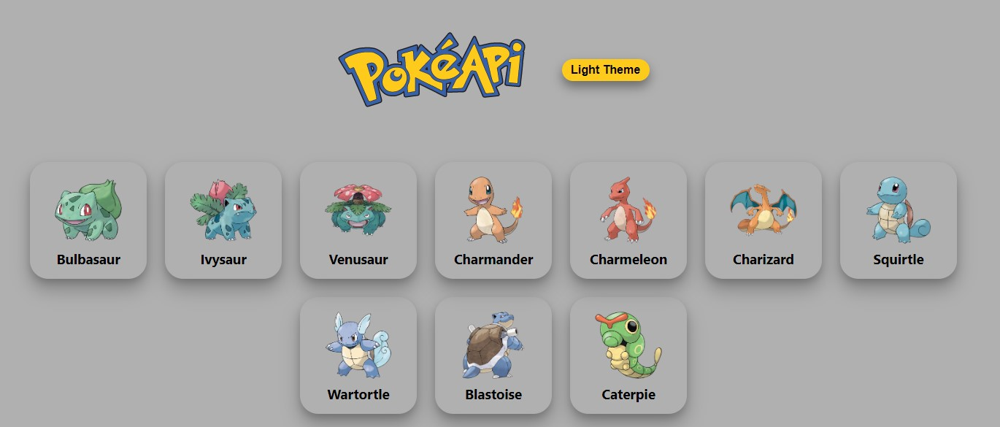
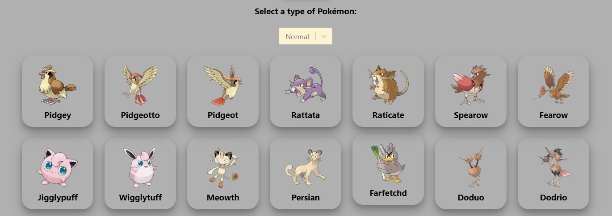
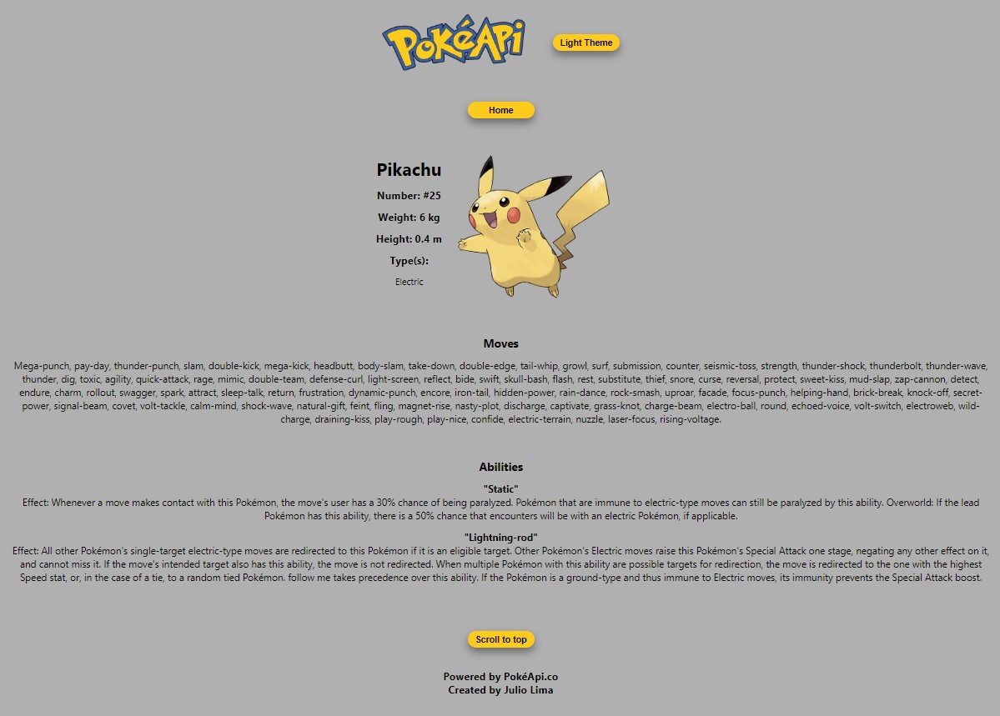
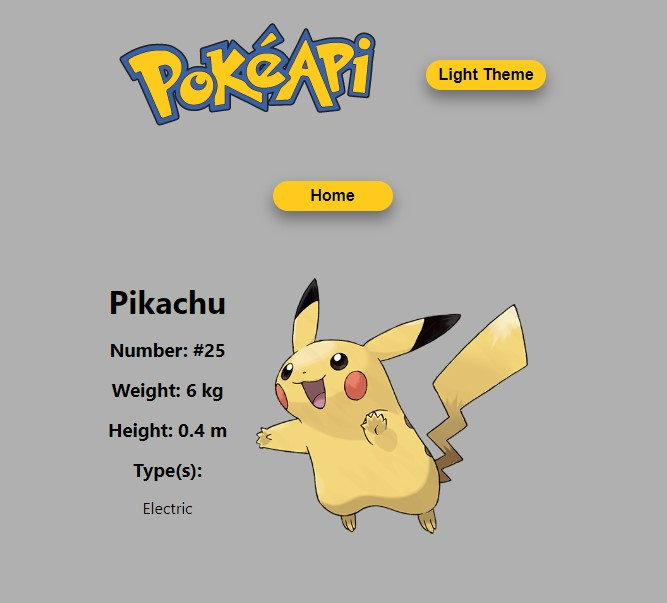
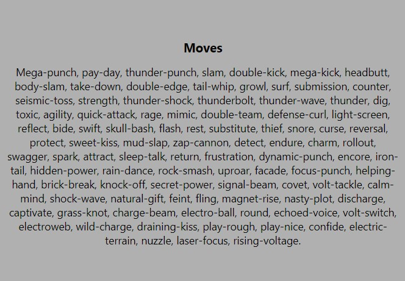

# Introduction

This project is the last challenge of the DEV QUEST course.

Our goal is to create a page that uses a RESTful API, and gets all the data from there.

# Technologies

* REACT (Function components with hooks);
* Context API;
* React Router DOM;
* Styled Components;

# Getting Started 

In the project directory, you can run:
### `npm install` then `npm start`

Runs the app in the development mode.\
Open [http://localhost:3000](http://localhost:3000) to view it in your browser.
The page will reload when you make changes.\

# Screenshots - Desktop

 

# Screenshots - Mobile

# Pokemon API

https://pokeapi.co/